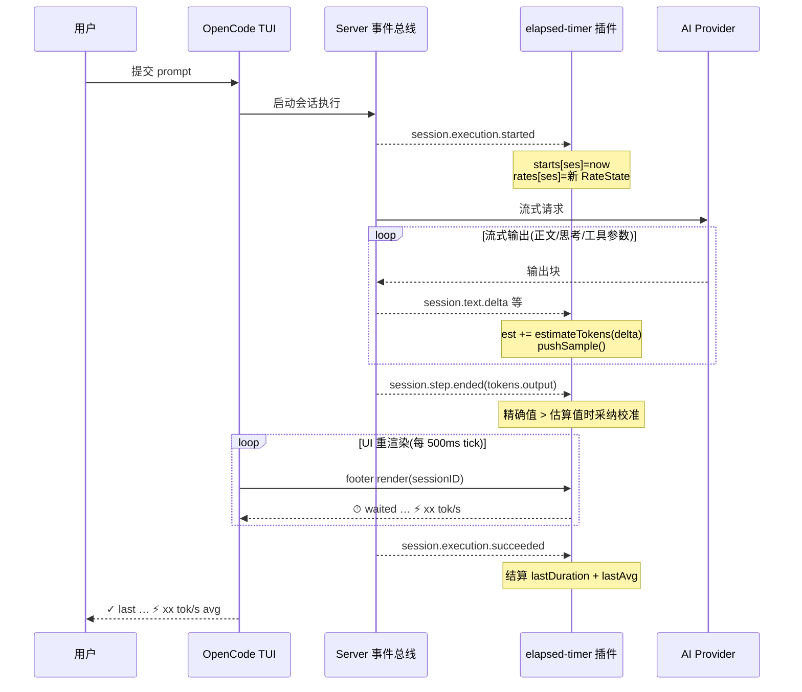
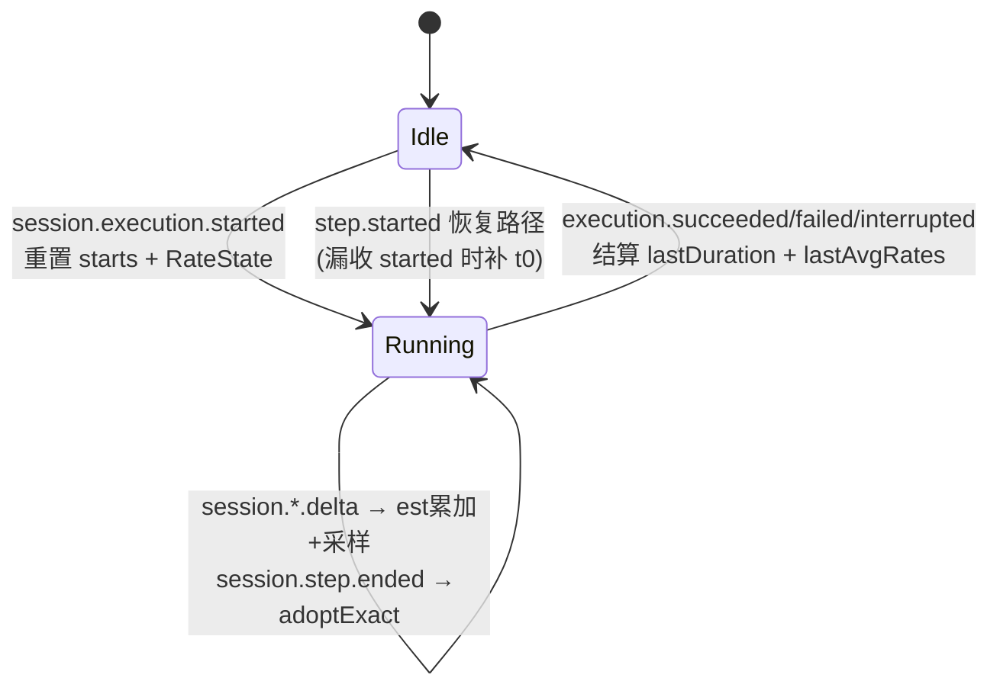
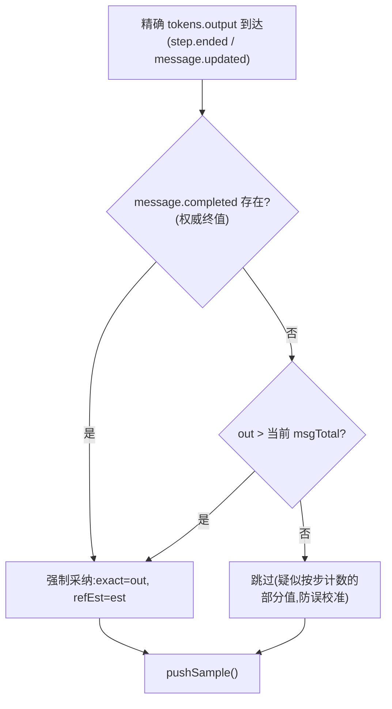

# opencode-elapsed-timer 设计文档

> OpenCode V2 TUI 插件:会话等待计时器 + 实时输出速率(tok/s)指示器
> 版本:v0.2.0(设计基线:tui.tsx @ 2026-10-01)
> 状态:已部署运行

---

## 1. 项目概述

在 OpenCode TUI 的 prompt footer 状态行,为**每个 session** 独立显示:

| 场景 | 显示内容 | 示例 |
|---|---|---|
| 运行中(有起始时间) | 等待计时 + 实时输出速率 | `⏱ waited 1m 02s   ⚡ 87 tok/s` |
| 运行中(起始时间缺失) | 占位提示 | `⏱ running` |
| 空闲(有历史) | 上轮用时 + 平均速率 | `✓ last 1m 02s   ⚡ 55 tok/s avg` |
| 流式停顿(工具执行间隙) | 隐藏速率,仅保留计时 | `⏱ waited 8s` |

设计目标:单文件实现、零配置、事件驱动、对所有 session 生效(含子代理 session)。

---

## 2. 代码目录树

```
opencode-elapsed-timer/                  # 开发工作区(本项目)
├── DESIGN.md                           # 本设计文档
├── README.md                           # 使用说明
├── LICENSE / .gitignore                # MIT 许可证 / Git 忽略规则(node_modules、package-lock 不入库)
├── package.json                        # npm 包定义
│     ├── exports["."]   → ./index.ts   #   服务端入口
│     ├── exports["./tui"] → ./tui.tsx  #   TUI 插件入口(OpenCode 自动发现)
│     └── peerDependencies: @opentui/core, @opentui/solid, solid-js
├── tsconfig.json                        # TS 配置(jsx: preserve, jsxImportSource: @opentui/solid)
├── index.ts                             # 服务端插件入口:空 setup 占位(216B)
├── tui.tsx                              # ★ 核心:计时 + tok/s 全部逻辑(约 280 行)
├── docs/
│   ├── interaction-sequence.json       # 顺序图源文件(archify sequence 规格,冻结)
│   └── interaction-sequence.html        # 交互顺序图(archify 生成的独立 HTML)
└── node_modules/                        # peer 依赖实装(不入库)

# 部署方式(OpenCode 运行时实际加载的位置):
由 `opencode plugin add github:dubuqiangu/opencode-elapsed-timer` 安装为全局包管理插件
  → 注册于 ~/.config/opencode/opencode.json 的 `plugins` 字段(完整包标识)
  → 版本即最近一次安装/更新时的 commit;`opencode plugin check` 检查更新
  → 迭代发布闭环:改 tui.tsx → esbuild 验证 → git push
      → opencode plugin update github:dubuqiangu/opencode-elapsed-timer → 重启生效
  → 旧的 junction 本地加载已摘除,避免与包安装形成双重加载(2026-10-02)
```

**文件职责划分**

| 文件 | 职责 |
|---|---|
| `index.ts` | 服务端插件入口。仅返回 `{ id, setup(){} }` 空实现,让 OpenCode 认出插件;真正逻辑全在 `tui.tsx` |
| `tui.tsx` | TUI 插件:事件订阅、token 计量、速率计算、footer 渲染、生命周期清理 |
| `package.json` | `exports["./tui"]` 是 OpenCode 发现 TUI 插件的关键约定;`@opencode/plugin` 依赖是发布规范的必需项 |

---

## 3. 运行环境与加载机制

1. **发现**:OpenCode 启动时扫描 `~/.config/opencode/plugins/<name>/`,读取 `package.json` 的 `exports["./tui"]`,加载为 TUI 插件;`exports["."]` 加载为服务端插件。
2. **模块解析**:`import { Plugin } from "@opencode/plugin/tui"` 由 **OpenCode 运行时**代理解析(本地无需安装该包);`solid-js` / `@opentui/solid` 从插件目录下的 `node_modules` 解析。
3. **JSX**:`tui.tsx` 顶部 `@jsxImportSource @opentui/solid` pragma,由 OpenCode 内置的 TSX 转换器按 solid-js 语义编译。
4. **热重载**:OpenCode watcher 监听插件文件变更并自动重新加载(实测日志确认:`loading plugin` 事件随文件修改触发)。
5. **生命周期**:`setup(context)` 在插件加载时执行一次;返回的清理函数在插件卸载/重载时执行。

---

## 4. 总体架构与数据流

三层结构,**事件采集 → 状态计算 → 响应式渲染**:

```
┌────────────────────────────────────────────────────────────────┐
│                     OpenCode Server(事件总线)                  │
│   session.execution.* / session.step.* / session.*.delta ...    │
└───────────────┬────────────────────────────────────────────────┘
                │ context.data.on(type, handler)   ← 8 类事件订阅
                ▼
┌────────────────────────────────────────────────────────────────┐
│                      tui.tsx 插件(纯内存状态)                   │
│                                                                │
│  starts: Map<sessionID, t0>          轮次起始时间               │
│  rates:  Map<sessionID, RateState>   token 记账 + 采样窗口      │
│  lastDurations: Map<sessionID, ms>    上轮时长                  │
│  lastAvgRates:  Map<sessionID, t/s>  上轮平均速率               │
└───────────────┬────────────────────────────────────────────────┘
                │ Solid 信号 now() 每 500ms tick → 触发重渲染
                ▼
┌────────────────────────────────────────────────────────────────┐
│         prompt.footer.status slot(append 模式,不覆盖原生行)      │
└────────────────────────────────────────────────────────────────┘
```

关键点:**状态按 sessionID 全隔离**——多 session 并发(含子代理)互不干扰,footer 渲染时只取当前 session 的状态。

---

## 5. 事件模型(交互时序)

### 5.1 订阅清单

| 事件 | 时机 | 载荷(经 `dataOf` 解包后) | 用途 |
|---|---|---|---|
| `session.execution.started` | 轮次开始 | `{sessionID}` | `starts.set(now)`;重置 `RateState` |
| `session.step.started` | 步骤开始 | `{sessionID, started, ...}` | 恢复路径:漏收 started 时用 `started` 补 |
| `session.execution.succeeded` / `failed` / `interrupted` | 轮次结束 | `{sessionID}` | 结算:时长 + 平均 tok/s,清理状态 |
| `session.text.delta` | 正文流式块 | `{sessionID, assistantMessageID, ordinal, delta}` | **实时速率主数据源** |
| `session.reasoning.delta` | 思考流式块 | 同上 | 计入输出(同样是模型生成) |
| `session.tool.input.delta` | 工具参数 JSON 流式块 | 同上 | 计入输出 |
| `session.step.ended` / `failed` | 步骤结束 | `{sessionID, assistantMessageID, tokens:{input,output,...}, cost}` | **精确 token 校准** |
| `message.part.delta` / `message.updated` | (旧事件族) | 见 §7 | 兜底,带防双计锁 |

### 5.2 信封解包(`dataOf`)

TUI 数据总线把载荷放在 `event.data`;官方 SDK 原始信封放在 `event.properties`。兼容三者:

```ts
const dataOf = (event) => event?.data ?? event?.properties ?? event
```

### 5.3 双事件族设计

当前 OpenCode V2 运行时以 **`session.*` 族**广播流式输出(`session.text.delta` 等);本地安装的 `@opencode-ai/sdk` 类型文件已过期(只含旧的 `message.part.*` 词汇),不能作为依据。设计上**双族共存**:

- `session.*` 族:主路径,优先;
- `message.*` 族:兜底(兼容其他 OpenCode 版本);
- **防双计锁** `RateState.sessionVocab`:本轮一旦收到任一 `session.*` delta,后续 `message.part.delta` 全部忽略——同一内容块绝不计两次。

### 5.4 交互时序图



交互式版本见 `docs/interaction-sequence.html`(可缩放/高亮/导出)。

---

## 6. 状态模型与轮次生命周期

### 6.1 数据结构

```ts
type MsgRate = {
  est: number          // 本消息累计估算 token(来自 delta 流)
  exact?: number        // 最近一次采纳的精确 output token
  refEst: number       // 采纳 exact 时的 est 快照(用于偏差重整)
}
type RateState = {
  msgs: Map<messageID, MsgRate>
  samples: Array<{ t: number; tok: number }>   // (时刻, 累计 token) 采样
  sessionVocab: boolean                        // 防双计锁
}
```

**消息总 token**:`msgTotal = exact + max(0, est − refEst)`(未采纳精确值时即 `est`)
**轮次总 token**:`turnTotal = Σ msgTotal`(支持一轮多消息/多步)

### 6.2 轮次状态机



状态全部为**进程内存态**:重启 OpenCode 后上轮统计清零,新一轮自然重建。

---

## 7. Token 计量设计

### 7.1 实时估算(`estimateTokens`)

流式块没有官方 token 数,用启发式估算:

- CJK(中日韩/假名/谚文)≈ **1 token/字符**
- 其他字符 ≈ **4 字符/token**
- 每块至少计 1

对速率显示而言,窗口内按同一口径估算,比值稳定,误差不放大。

### 7.2 精确校准(`adoptExact`)

`session.step.ended` 携带精确 `tokens.output`,但**语义不确定**(可能是消息累计,也可能按步计),采纳规则:



采纳后的公式保证:exact 覆盖之前的 est,**后续 delta 在 exact 基础上继续累加**,不丢不重。

### 7.3 采样(`pushSample`)

每次估算/校准变更时追加 `{t: now, tok: turnTotal}` 样本,并修剪 10s 之前的旧样本(滑动窗口)。

---

## 8. 速率计算算法(`liveRate`)

在 footer 每次渲染时(500ms tick)对当前 session 的样本窗口求速率:

1. **新鲜度门槛**:最新样本距今 > **4000ms** → 不显示(流式停顿,如工具执行间隙、长等待);
2. **基线选择**:取"距最新样本 ≥2500ms"的最早样本,否则取窗口最老样本(窗口 2.5–10s,兼顾"实时感"与平滑);
3. **有效性**:时间跨度 `dt < 0.4s` 或样本不足 2 个 → 不显示;
4. **输出**:`rate = (last.tok − base.tok) / dt`,四舍五入,`rate ≤ 0` 不显示。

空闲时的**平均速率**在轮次结算时一次性计算:`lastAvg = turnTotal / 轮次时长`。

---

## 9. 渲染层设计

```tsx
const [now, setNow] = createSignal(Date.now())
setInterval(() => setNow(Date.now()), 500)          // 驱动重渲染的时钟

context.ui.slot({
  append: "prompt.footer.status",                   // 追加到原生状态行,不覆盖
  render: (props) => {
    const sessionID = props?.sessionID ?? router.current()?.params?.sessionID
    const running = context.data?.session?.status?.(sessionID) === "running"
    // 组装 parts[] → <text fg={theme.text.muted}>{parts.join("   ")}</text>
  },
})
```

- **响应式原理**:render 内读取 `now()` 信号,tick 触发 Solid 重渲染,重新求值 `liveRate`;
- **sessionID 来源**:优先 slot props,回退当前路由(兼容不同挂载点);
- **颜色**:主题 `text.muted` token,自动适配明暗主题;
- **多 session**:每个 session 的 footer 各自渲染,读各自的 Map 条目。

---

## 10. 边界情况

| 场景 | 处理 |
|---|---|
| 漏收 `execution.started`(TUI 中途打开) | `session.step.started` 的 `started` 数字补起始时间(仅当 `starts` 无记录) |
| 一轮多消息/多步 | 按 `messageID` 分别记账,`turnTotal` 求和 |
| 精确值按步计数(非累计) | `out > 当前估算` 门槛拒绝倒退的读数 |
| 双事件族同时到达 | `sessionVocab` 锁,先到者胜,后者忽略 |
| 工具执行间隙(无流) | 4s 新鲜度门槛自动隐藏速率,恢复流式后重现 |
| 子代理 session | 事件带各自 sessionID,状态天然隔离;查看子 session 时 footer 显示其自身速率 |
| 订阅失败(未知事件名等) | `listen()` try/catch,单个订阅失败不影响其余功能 |
| 插件卸载/热重载 | 清理函数:clearInterval + slot 注销 + 全部退订 |

---

## 11. 已知限制

1. **估算误差**:4字符/token 启发式,中英混排下实时速率偏差约 ±20–30%;step 边界的精确校准可收敛累计值,但窗口内速率仍是估算口径。
2. **精确 token 粒度**:仅在 step 结束时到达;单步长流式期间速率完全依赖估算。
3. **内存态**:上轮时长/平均速率不落盘,重启即清零。
4. **校准跳变**:采纳精确值瞬间,累计曲线可能小幅修正,窗口速率短暂波动。
5. ~~install.ps1 过时~~ **已解决(v0.2.0)**:脚本移除,改为标准插件包分发——`opencode plugin add github:dubuqiangu/opencode-elapsed-timer` 一键安装,依赖随包自动安装。

---

## 12. 验证

- **语法/JSX**:每次改动后 esbuild 校验
  `npx esbuild tui.tsx --loader:.tsx=tsx --jsx=automatic`
  (完整 tsc 不可行:`@opencode/plugin/tui` 仅由 OpenCode 运行时解析,本地无类型)
- **事件词汇取证**:官方桌面端 reducer 消费 `session.text.delta`(`anomalyco/opencode` `server-session-v2-reducer.ts`);运行时二进制含全部订阅事件名字符串
- **实测**:重启 OpenCode(或等 watcher 热重载)后发起一轮对话,观察 footer 流式阶段出现 `⚡ tok/s`
- **0.3.0 stats**:footer 出现 `Σ …`;`/tokens` 打开弹窗;API 探测可经 `opencode api get "/api/experimental/session/stats?from=<epoch_ms>"` 复现

---

## 12A. Token 消耗统计(0.3.0,基于原生 SessionStats API)

### 12A.1 架构决策:零采集层

初版功能分解曾计划"服务端 `index.ts` 订阅事件 → 自聚合 → `ctx.storage` 落盘"。取证后确认 OpenCode V2 服务端**原生已做全量聚合**并暴露只读查询端点,采集层整体砍掉:

| 原计划组件 | 取代方式 |
|---|---|
| 服务端采集(index.ts 订阅 session.* 聚合) | 服务端自身已统计(覆盖全部会话,含 headless 与 subagents) |
| `ctx.storage` 持久化 + 保留策略 | 服务端数据库自管,插件重启不丢 |
| 自定义 RPC 双端通道 | TUI 插件直接 `context.client.experimental.session.stats(...)` |
| 去重/时区/重放风险 | 不存在(纯只读查询) |

数据源:`GET /api/experimental/session/stats`(operationId `experimental.session.stats`)。
**关键参数格式(实测)**:`from`/`to` 为 **epoch 毫秒字符串**(ISO/日期串会 500);`timezone` 传本地 IANA 时区名(影响 `activity[].date` 的日切归属);`project` 可选,缺省全局。响应:`tokens{input,output,reasoning,cache{read,write}}`、`cost`、`models[]`(按 Model.Ref 细分)、`activity[]`(按日 steps)、`sessions/steps/activeDays/streak`。

### 12A.2 展示与刷新

- **footer**:追加 `Σ <今日总量>`,与 tok/s 同行同级。口径 = 今日 `input+output+reasoning`(cache 读写成本结构不同,不计入 Σ,弹窗中单列)。今日为 0 或 API 不可用时隐藏。
- **`/tokens` 弹窗**(别名 `/tok`、`/usage`,同时进命令面板):今日按模型明细(≤12 行,按输出排序)+ 今日合计 + 近 7 日 steps 趋势(取自全量查询的 `activity` 尾部 7 条)+ 累计总量 + 累计 Top 5 模型。`cost` 为 0(模型未配价)时整列隐藏。0.4.0 起升级为**开关式 `session.panel` 侧边面板**(头部含当前会话实时计时/tok/s/今日 Σ,`createMemo` 响应式刷新;`/tokens` 或 `Esc` 收起,`f` 全屏,面板打开期间每次 step 结束自动刷新今日+全量明细;会话外降级为普通弹窗)。
- **刷新策略**:插件加载时取一次;`session.step.ended/failed` 后 1.5s 防抖刷新;弹窗打开时双查询(今日+全量)并回写 footer 信号;500ms tick 检测跨零点自动重取并复位失败标记。
- **降级**:client 方法缺失或请求失败 → Σ 静默隐藏、弹窗显示错误文案,`console.error` 记录一次;不阻塞计时/tok/s 主功能。

### 12A.3 已知限制与风险

- 端点带 `experimental`,OpenCode 升级可能变动 → 全部调用收敛在 `statsCall()` 单函数,便于替换。
- TUI 内置 client 的方法路径 `experimental.session.stats` 依赖宿主版本 → 防御式访问,运行时验证。
- 全量查询的 `models[]` 可能上百行(探活/失败请求 tokens 为 0)→ 弹窗按输出过滤排序,只显示 Top 5。

---

## 13. 未来扩展(已评估可行性)

| 方向 | 依赖的官方 API | 形态 |
|---|---|---|
| Session 状态面板(跟随当前 session) | `session.panel` slot(响应式 `panel.sessionID`) | 侧边面板,可全屏 |
| ~~按模型/按日消耗统计~~ **已实现(0.3.0)** | 原生 `GET /api/experimental/session/stats` | footer Σ + `/tokens` 弹窗 |
| ~~费用(USD)估算~~ **已随 0.3.0 实现** | stats API 自带 `cost`(模型未配价时为 0) | 弹窗内展示 |
| 全 session 状态列表 | `sidebar.content` slot | 左侧列表:各 session 运行态 + 速率 |
| 本轮/累计花费(USD) | `tokens` × 模型单价;`context.storage.store()` 持久化 | footer 或面板 |
| 跑完弹"战报" | `context.ui.dialog.show()` | 本轮 token/时长/花费弹窗 |
| 完成提示音/通知 | `context.attention.notify()` | 轮次结束时 |
| 模型/工具活动指示 | `session.step.started`(model/agent)、`session.tool.*` | footer 或面板 |

---

## 14. 变更记录

| 日期 | 版本 | 变更 |
|---|---|---|
| 2026-09-29 | 0.1.0 | 初版:等待计时 + 上轮时长 |
| 2026-10-01 | 0.2.0 | 实时 tok/s:迁移到 `session.*` 事件族(根因:运行时弃用 `message.part.delta` 广播),增加精确 token 校准、防双计锁、空闲平均速率 |
| 2026-10-02 | 0.2.0 | 分发方式升级:git 仓库化发布 GitHub(`github:dubuqiangu/opencode-elapsed-timer`),原生一键安装实测通过;移除 install.ps1 与 junction 加载,补齐 LICENSE/.gitignore/发布规范 package.json;运行逻辑无变化 |
| 2026-10-03 | 0.3.0 | 跨会话消耗统计:footer 新增今日总耗 Σ,新增 `/tokens` 命令(今日按模型明细/近7日趋势/累计汇总);直接消费服务端原生 `GET /api/experimental/session/stats`(from/to 为 epoch 毫秒串,timezone 传本地时区),无采集层、无本地存储、无 RPC;API 不可用时静默降级 |
| 2026-10-03 | 0.4.0 | `/tokens` 升级为开关式 `session.panel` 侧边栏面板:头部当前会话实时读数(计时/tok/s/Σ,createMemo 响应式),`/tokens`/Esc 收起、`f` 全屏、面板打开期间 step 结束自动刷新;会话外降级为弹窗;footer 保持不变 |
