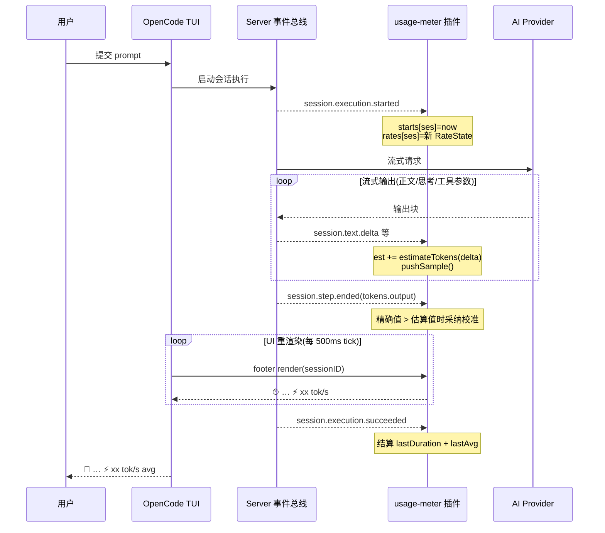
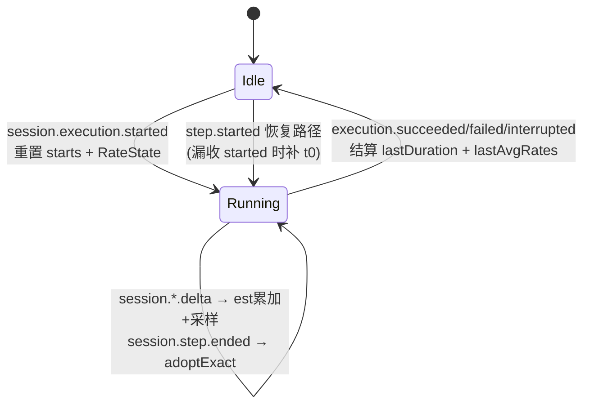
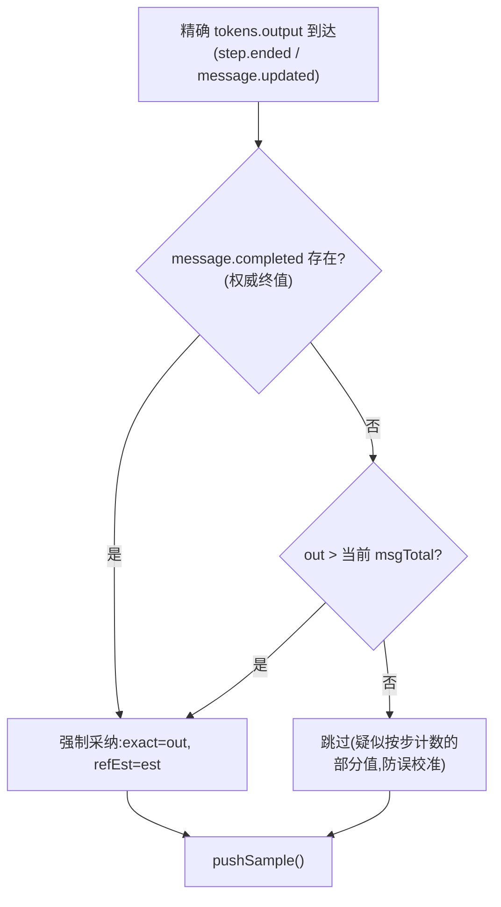

# opencode-usage-meter 设计文档

> OpenCode V2 TUI 插件:会话等待计时器 + 实时输出速率(tok/s)指示器
> 版本:v0.2.0(设计基线:tui.tsx @ 2026-10-01)
> 状态:已部署运行

---

## 1. 项目概述

在 OpenCode TUI 的 prompt footer 状态行,为**每个 session** 独立显示:

| 场景 | 显示内容 | 示例 |
|---|---|---|
| 运行中(有起始时间) | 等待计时 + 实时输出速率 | `⏱ 1m 02s   ⚡ 87 tok/s` |
| 运行中(起始时间缺失) | 占位提示 | `⏱ running` |
| 空闲(有历史) | 上轮用时 + 平均速率 | `🏁 1m 02s   ⚡ 55 tok/s avg` |
| 流式停顿(工具执行间隙) | 隐藏速率,仅保留计时 | `⏱ 8s` |

设计目标:单文件实现、零配置、事件驱动、对所有 session 生效(含子代理 session)。

---

## 2. 代码目录树

```
opencode-usage-meter/                   # 开发工作区(本项目;本地目录随 0.5.0 同步改名)
├── DESIGN.md                           # 本设计文档
├── README.md                           # 使用说明
├── LICENSE / .gitignore                # MIT 许可证 / Git 忽略规则(node_modules、package-lock 不入库)
├── package.json                        # npm 包定义
│     ├── exports["."]   → ./src/index.ts   #   服务端入口
│     ├── exports["./tui"] → ./src/tui.tsx  #   TUI 插件入口(OpenCode 自动发现)
│     └── peerDependencies: @opentui/core, @opentui/solid, solid-js
├── tsconfig.json                        # TS 配置(jsx: preserve, jsxImportSource: @opentui/solid)
├── src/                                 # 源码(0.4.1 起采用 src/ 布局,官方示例同款)
│   ├── index.ts                         # 服务端插件入口:空 setup 占位
│   └── tui.tsx                          # ★ 核心:计时 + tok/s + 统计面板全部逻辑
├── docs/
│   ├── interaction-sequence.json       # 顺序图源文件(archify sequence 规格,冻结)
│   └── interaction-sequence.html        # 交互顺序图(archify 生成的独立 HTML)
└── node_modules/                        # peer 依赖实装(不入库)

# 部署方式(OpenCode 运行时实际加载的位置):
由 `opencode plugin add github:dubuqiangu/opencode-usage-meter` 安装为全局包管理插件
  → 注册于 ~/.config/opencode/opencode.json 的 `plugins` 字段(完整包标识)
  → 版本即最近一次安装/更新时的 commit;`opencode plugin check` 检查更新
  → 迭代发布闭环:改 src/tui.tsx → esbuild 验证 → git push
      → opencode plugin update github:dubuqiangu/opencode-usage-meter → 重启生效
  → 旧的 junction 本地加载已摘除,避免与包安装形成双重加载(2026-10-02)
```

**文件职责划分**

| 文件 | 职责 |
|---|---|
| `src/index.ts` | 服务端插件入口。仅返回 `{ id, setup(){} }` 空实现,让 OpenCode 认出插件;真正逻辑全在 `src/tui.tsx` |
| `src/tui.tsx` | TUI 插件:事件订阅、token 计量、速率计算、footer 渲染、统计面板、生命周期清理 |
| `package.json` | `exports["./tui"]` 是 OpenCode 发现 TUI 插件的关键约定;`@opencode/plugin` 依赖是发布规范的必需项 |

---

## 3. 运行环境与加载机制

1. **发现**:OpenCode 启动时扫描 `~/.config/opencode/plugins/<name>/`,读取 `package.json` 的 `exports["./tui"]`,加载为 TUI 插件;`exports["."]` 加载为服务端插件。
2. **模块解析**:`import { Plugin } from "@opencode/plugin/tui"` 由 **OpenCode 运行时**代理解析(本地无需安装该包);`solid-js` / `@opentui/solid` 从插件目录下的 `node_modules` 解析。
3. **JSX**:`tui.tsx` 顶部 `@jsxImportSource @opentui/solid` pragma,由 OpenCode 内置的 TSX 转换器按 solid-js 语义编译。
4. **热重载**:OpenCode watcher 监听插件文件变更并自动重新加载(实测日志确认:`loading plugin` 事件随文件修改触发)。
5. **生命周期**:`setup(context)` 在插件加载时执行一次;返回的清理函数在插件卸载/重载时执行。

---

## 4. 总体架构与数据流

三层结构,**事件采集 → 状态计算 → 响应式渲染**:

```
┌────────────────────────────────────────────────────────────────┐
│                     OpenCode Server(事件总线)                  │
│   session.execution.* / session.step.* / session.*.delta ...    │
└───────────────┬────────────────────────────────────────────────┘
                │ context.data.on(type, handler)   ← 8 类事件订阅
                ▼
┌────────────────────────────────────────────────────────────────┐
│                      tui.tsx 插件(纯内存状态)                   │
│                                                                │
│  starts: Map<sessionID, t0>          轮次起始时间               │
│  rates:  Map<sessionID, RateState>   token 记账 + 采样窗口      │
│  lastDurations: Map<sessionID, ms>    上轮时长                  │
│  lastAvgRates:  Map<sessionID, t/s>  上轮平均速率               │
└───────────────┬────────────────────────────────────────────────┘
                │ Solid 信号 now() 每 500ms tick → 触发重渲染
                ▼
┌────────────────────────────────────────────────────────────────┐
│         prompt.footer.status slot(append 模式,不覆盖原生行)      │
└────────────────────────────────────────────────────────────────┘
```

关键点:**状态按 sessionID 全隔离**——多 session 并发(含子代理)互不干扰,footer 渲染时只取当前 session 的状态。

---

## 5. 事件模型(交互时序)

### 5.1 订阅清单

| 事件 | 时机 | 载荷(经 `dataOf` 解包后) | 用途 |
|---|---|---|---|
| `session.execution.started` | 轮次开始 | `{sessionID}` | `starts.set(now)`;重置 `RateState` |
| `session.step.started` | 步骤开始 | `{sessionID, started, ...}` | 恢复路径:漏收 started 时用 `started` 补 |
| `session.execution.succeeded` / `failed` / `interrupted` | 轮次结束 | `{sessionID}` | 结算:时长 + 平均 tok/s,清理状态 |
| `session.text.delta` | 正文流式块 | `{sessionID, assistantMessageID, ordinal, delta}` | **实时速率主数据源** |
| `session.reasoning.delta` | 思考流式块 | 同上 | 计入输出(同样是模型生成) |
| `session.tool.input.delta` | 工具参数 JSON 流式块 | 同上 | 计入输出 |
| `session.step.ended` / `failed` | 步骤结束 | `{sessionID, assistantMessageID, tokens:{input,output,...}, cost}` | **精确 token 校准** |
| `message.part.delta` / `message.updated` | (旧事件族) | 见 §7 | 兜底,带防双计锁 |

### 5.2 信封解包(`dataOf`)

TUI 数据总线把载荷放在 `event.data`;官方 SDK 原始信封放在 `event.properties`。兼容三者:

```ts
const dataOf = (event) => event?.data ?? event?.properties ?? event
```

### 5.3 双事件族设计

当前 OpenCode V2 运行时以 **`session.*` 族**广播流式输出(`session.text.delta` 等);本地安装的 `@opencode-ai/sdk` 类型文件已过期(只含旧的 `message.part.*` 词汇),不能作为依据。设计上**双族共存**:

- `session.*` 族:主路径,优先;
- `message.*` 族:兜底(兼容其他 OpenCode 版本);
- **防双计锁** `RateState.sessionVocab`:本轮一旦收到任一 `session.*` delta,后续 `message.part.delta` 全部忽略——同一内容块绝不计两次。

### 5.4 交互时序图



交互式版本见 `docs/interaction-sequence.html`(可缩放/高亮/导出)。

---

## 6. 状态模型与轮次生命周期

### 6.1 数据结构

```ts
type MsgRate = {
  est: number          // 本消息累计估算 token(来自 delta 流)
  exact?: number        // 最近一次采纳的精确 output token
  refEst: number       // 采纳 exact 时的 est 快照(用于偏差重整)
}
type RateState = {
  msgs: Map<messageID, MsgRate>
  samples: Array<{ t: number; tok: number }>   // (时刻, 累计 token) 采样
  sessionVocab: boolean                        // 防双计锁
}
```

**消息总 token**:`msgTotal = exact + max(0, est − refEst)`(未采纳精确值时即 `est`)
**轮次总 token**:`turnTotal = Σ msgTotal`(支持一轮多消息/多步)

### 6.2 轮次状态机



状态全部为**进程内存态**:重启 OpenCode 后上轮统计清零,新一轮自然重建。

---

## 7. Token 计量设计

### 7.1 实时估算(`estimateTokens`)

流式块没有官方 token 数,用启发式估算:

- CJK(中日韩/假名/谚文)≈ **1 token/字符**
- 其他字符 ≈ **4 字符/token**
- 每块至少计 1

对速率显示而言,窗口内按同一口径估算,比值稳定,误差不放大。

### 7.2 精确校准(`adoptExact`)

`session.step.ended` 携带精确 `tokens.output`,但**语义不确定**(可能是消息累计,也可能按步计),采纳规则:



采纳后的公式保证:exact 覆盖之前的 est,**后续 delta 在 exact 基础上继续累加**,不丢不重。

### 7.3 采样(`pushSample`)

每次估算/校准变更时追加 `{t: now, tok: turnTotal}` 样本,并修剪 10s 之前的旧样本(滑动窗口)。

---

## 8. 速率计算算法(`liveRate`)

在 footer 每次渲染时(500ms tick)对当前 session 的样本窗口求速率:

1. **新鲜度门槛**:最新样本距今 > **4000ms** → 不显示(流式停顿,如工具执行间隙、长等待);
2. **基线选择**:取"距最新样本 ≥2500ms"的最早样本,否则取窗口最老样本(窗口 2.5–10s,兼顾"实时感"与平滑);
3. **有效性**:时间跨度 `dt < 0.4s` 或样本不足 2 个 → 不显示;
4. **输出**:`rate = (last.tok − base.tok) / dt`,四舍五入,`rate ≤ 0` 不显示。

空闲时的**平均速率**在轮次结算时一次性计算:`lastAvg = turnTotal / 轮次时长`。

---

## 9. 渲染层设计

```tsx
const [now, setNow] = createSignal(Date.now())
setInterval(() => setNow(Date.now()), 500)          // 驱动重渲染的时钟

context.ui.slot({
  append: "prompt.footer.status",                   // 追加到原生状态行,不覆盖
  render: (props) => {
    const sessionID = props?.sessionID ?? router.current()?.params?.sessionID
    const running = context.data?.session?.status?.(sessionID) === "running"
    // 组装 parts[] → <text fg={theme.text.muted}>{parts.join("   ")}</text>
  },
})
```

- **响应式原理**:render 内读取 `now()` 信号,tick 触发 Solid 重渲染,重新求值 `liveRate`;
- **sessionID 来源**:优先 slot props,回退当前路由(兼容不同挂载点);
- **颜色**:主题 `text.muted` token,自动适配明暗主题;
- **多 session**:每个 session 的 footer 各自渲染,读各自的 Map 条目。

---

## 10. 边界情况

| 场景 | 处理 |
|---|---|
| 漏收 `execution.started`(TUI 中途打开) | `session.step.started` 的 `started` 数字补起始时间(仅当 `starts` 无记录) |
| 一轮多消息/多步 | 按 `messageID` 分别记账,`turnTotal` 求和 |
| 精确值按步计数(非累计) | `out > 当前估算` 门槛拒绝倒退的读数 |
| 双事件族同时到达 | `sessionVocab` 锁,先到者胜,后者忽略 |
| 工具执行间隙(无流) | 4s 新鲜度门槛自动隐藏速率,恢复流式后重现 |
| 子代理 session | 事件带各自 sessionID,状态天然隔离;查看子 session 时 footer 显示其自身速率 |
| 订阅失败(未知事件名等) | `listen()` try/catch,单个订阅失败不影响其余功能 |
| 插件卸载/热重载 | 清理函数:clearInterval + slot 注销 + 全部退订 |

---

## 11. 已知限制

1. **估算误差**:4字符/token 启发式,中英混排下实时速率偏差约 ±20–30%;step 边界的精确校准可收敛累计值,但窗口内速率仍是估算口径。
2. **精确 token 粒度**:仅在 step 结束时到达;单步长流式期间速率完全依赖估算。
3. **内存态**:上轮时长/平均速率不落盘,重启即清零。
4. **校准跳变**:采纳精确值瞬间,累计曲线可能小幅修正,窗口速率短暂波动。
5. ~~install.ps1 过时~~ **已解决(v0.2.0)**:脚本移除,改为标准插件包分发——`opencode plugin add github:dubuqiangu/opencode-elapsed-timer` 一键安装,依赖随包自动安装。

---

## 12. 验证

- **语法/JSX**:每次改动后 esbuild 校验
  `npx esbuild src/tui.tsx --loader:.tsx=tsx --jsx=automatic`
  (完整 tsc 不可行:`@opencode/plugin/tui` 仅由 OpenCode 运行时解析,本地无类型)
- **事件词汇取证**:官方桌面端 reducer 消费 `session.text.delta`(`anomalyco/opencode` `server-session-v2-reducer.ts`);运行时二进制含全部订阅事件名字符串
- **实测**:重启 OpenCode(或等 watcher 热重载)后发起一轮对话,观察 footer 流式阶段出现 `⚡ tok/s`
- **0.3.0 stats**:footer 出现 `Σ …`;`/tokens` 打开弹窗;API 探测可经 `opencode api get "/api/experimental/session/stats?from=<epoch_ms>"` 复现

---

## 12A. Token 消耗统计(0.3.0,基于原生 SessionStats API)

### 12A.1 架构决策:零采集层

初版功能分解曾计划"服务端 `index.ts` 订阅事件 → 自聚合 → `ctx.storage` 落盘"。取证后确认 OpenCode V2 服务端**原生已做全量聚合**并暴露只读查询端点,采集层整体砍掉:

| 原计划组件 | 取代方式 |
|---|---|
| 服务端采集(index.ts 订阅 session.* 聚合) | 服务端自身已统计(覆盖全部会话,含 headless 与 subagents) |
| `ctx.storage` 持久化 + 保留策略 | 服务端数据库自管,插件重启不丢 |
| 自定义 RPC 双端通道 | TUI 插件直接 `context.client.experimental.session.stats(...)` |
| 去重/时区/重放风险 | 不存在(纯只读查询) |

数据源:`GET /api/experimental/session/stats`(operationId `experimental.session.stats`)。
**关键参数格式(实测)**:`from`/`to` 为 **epoch 毫秒字符串**(ISO/日期串会 500);`timezone` 传本地 IANA 时区名(影响 `activity[].date` 的日切归属);`project` 可选,缺省全局。响应:`tokens{input,output,reasoning,cache{read,write}}`、`cost`、`models[]`(按 Model.Ref 细分)、`activity[]`(按日 steps)、`sessions/steps/activeDays/streak`。

### 12A.2 展示与刷新

- **footer**:追加 `Σ <今日总量>`,与 tok/s 同行同级。口径 = 今日 `input+output+reasoning`(cache 读写成本结构不同,不计入 Σ,弹窗中单列)。今日为 0 或 API 不可用时隐藏。0.4.2 起 Σ 旁追加 `hit <nn>%` 今日缓存命中率(口径 `cache.read ÷ (cache.read + input)`,分母 0 隐藏)。0.6.0 起曾追加 `ctx <nn>%` 当前窗口占用,**0.6.4 起从 footer 移除**(与 tok/s 同级冗余;窗口口径完整保留在面板"当前窗口"块,见 §12B/§12D)。
- **`/usage-full` 命令**(0.5.0 前为 `/tokens`,别名 `/tok`、`/usage` 已移除;同时进命令面板):今日按模型明细(≤12 行,按输出排序)+ 今日合计 + 近 7 日 steps 趋势(取自全量查询的 `activity` 尾部 7 条)+ 累计总量 + 累计 Top 5 模型。`cost` 为 0(模型未配价)时整列隐藏。0.4.0 起升级为**开关式 `session.panel` 侧边面板**(头部含当前会话实时计时/tok/s/今日 Σ,0.6.0 起头部另有"当前窗口/本会话累计/子代理"三块,见 §12B,`createMemo` 响应式刷新;`/usage-full` 或 `Esc` 收起,`f` 全屏,面板打开期间每次 step 结束自动刷新今日+全量明细;会话外降级为普通弹窗)。
- **刷新策略**:插件加载时取一次;`session.step.ended/failed` 后 1.5s 防抖刷新;**60s 周期刷新(0.6.8)**——后台会话(子代理/headless)消耗不触发本会话轮事件,定时器保证空闲期 Σ/hit 不滞后;弹窗打开时双查询(今日+全量)并回写 footer 信号;500ms tick 检测跨零点自动重取并复位失败标记。footer 的 hit 显示一位小数(0.6.8):日级比值天然稳定(缓存命中主导),整数四舍五入会掩盖真实移动,一位小数让变化可见且对齐原生精度风格。
- **降级**:client 方法缺失或请求失败 → Σ 静默隐藏、弹窗显示错误文案,`console.error` 记录一次;不阻塞计时/tok/s 主功能。

### 12A.3 已知限制与风险

- 端点带 `experimental`,OpenCode 升级可能变动 → 全部调用收敛在 `statsCall()` 单函数,便于替换。
- TUI 内置 client 的方法路径 `experimental.session.stats` 依赖宿主版本 → 防御式访问,运行时验证。
- 全量查询的 `models[]` 可能上百行(探活/失败请求 tokens 为 0)→ 弹窗按输出过滤排序,只显示 Top 5。
- **热重载生命周期(0.7.3 真机实证)**:`opencode plugin update` 只改磁盘包,运行中宿主仍持旧代码;`/reload` 会拆掉旧实例的定时器与事件订阅(500ms 时钟、session.* 订阅)**但不从磁盘重载插件**——表现为 footer 计时冻结、tok/s 不再更新、⏳ 无起点态。**更新后必须完整重启 TUI** 才加载新版本并恢复全部接线。

### 12B. 当前会话窗口与会话累计(0.6.0)

**动机**:原生有侧栏 Context 面板但无常驻占用%/预警;第三方 opencode-context-usage 已验证全部数据通道。本节功能只读已同步的 TUI 状态,零服务端调用、零采集。

**数据通道**(均经参考实现验证):
- **窗口快照**:`context.data.session.message.list(sessionID)` 中最后一条 `tokens.output > 0` 的 assistant 消息
- **窗口占用** = `input + output + reasoning + cache.read + cache.write`(与原生侧栏 Context 面板同源同数)÷ 模型 `limit.context`(来自 `context.data.location.model.list(location)`,按 `providerID` + `model.id` 匹配)
- **会话累计**:`context.data.session.get(sessionID)` 的 `session.tokens` / `session.cost` 权威聚合(TUI 消息窗只保留近期消息时依然全量);轮数从 message.list 统计 assistant 条数(截断时偏小,仅展示)
- **子代理**:`context.data.session.list()` 按 `parentID` BFS 遍历委派树(上限 200 防病态树),子会话自带 `tokens`/`cost`,可递归归总

**渲染细节(0.6.1 审视定稿;0.6.4 修订)**:
- ~~footer 的 ctx 段用 `box(flexDirection: row)` 内**兄弟 `<text>`** 分色渲染~~(0.6.4:ctx 段已从 footer 撤下,该分色渲染模式保留为已验证做法;`ctxPercent` 实现保留备未来界面用)
- 降级弹窗传入当前 sessionID(取自 `router.current()`):会话内的弹窗兜底同样展示"当前窗口/本会话/子代理"三块;会话外则仅显示日/累计统计
- 子代理块在全部子会话尚未上报任何用量(tokens 全零或缺失)时整体隐藏,防零值噪音行

**口径对照**(三者并存,UI 必须标签区分,防误读):

| 口径 | 范围 | cache 计入 | 位置 |
|---|---|---|---|
| 今日 Σ | 当日全部会话 | 不计入 | footer / 面板头部 |
| 会话累计 | 本会话(压缩后不重置) | 计入 | 面板"本会话累计" |
| 窗口占用 | 最后一次请求 | 计入(缓存命中仍占窗口) | 面板"当前窗口"(0.6.4 起 footer 不再显示) |

**命中率口径**:会话级用 `cache.read ÷ (input + cache.read + cache.write)`(与原生面板/参考实现一致,分母含 cache write,更严格);footer 日级维持 `read ÷ (read + input)`(日级 stats API 口径)。两口径并存属有意为之。

**footer 指标段配置化(0.6.6 引入,0.6.7 设置入口,0.7.0 重定默认)**:footer 的 hit 段支持两种维度——`today`(全 session 日级汇总,`hit nn%`)与 `session`(当前会话,严格口径,`hit·s nn%`);**0.7.0 起 footer 默认只显示 ⏱ 与 ⚡**(速率链路含空闲终值不变),`Σ`/`hit` 段改为**默认关的 opt-in 开关**。全部经 **`/usage-settings` 设置弹窗**配置(四项:hit 维度 `d`、footer Σ `f`、footer hit `h`、右栏指标块 `b`),持久化于 `storage.store("usage-meter.settings")`(2.0.21 宿主尚无插件 options 配置通道,故命令+存储自洽;未来宿主支持 `{ package, options }` 后可加配置文件直读);旧存储缺键时由读取器按文档默认值归一。另有命令面板"切换 hit 维度"直切命令兜底。`/usage-full` 面板不受影响,始终完整展示两个维度。

**右栏指标块(0.7.0)**:会话右栏(标题 + Context + MCP + agents 区块的宿主侧栏)经 v2.0.21 源码取证确认——宿主自己的 Context/MCP 区块就是 `feature-plugins/sidebar/context.tsx`/`mcp.tsx` 通过 `append: "sidebar.content"` 挂载的(即 `routes/session/sidebar.tsx` 右栏 scrollbox 内的 `sidebar.content` slot)。插件以同通道 `append: "sidebar.content"` 追加 `Stats` 块,落在上述区块下方:当前会话实时 ⏱/⚡ **分行展示**(空闲显示 🏁 + 精确速率,与 footer 同数据同口径)+ `📊 总量 (today)` + `🎯 命中率 (today|session)`(维度跟随设置;标注统一放括号,0.7.1 起块内全英文图标行——右栏窄列单行并排会挤压换行)。默认开,设置中可关;生命周期纳入清理。

**80% 压缩预警**:窗口占用 ≥80% 时,面板占用行追加"▲ 接近压缩阈值"。阈值为常量 `CTX_WARN_PCT`,未来可配置化。(0.6.4 起 footer 不再有 ctx 段,预警仅在面板出现。)

**已知限制**:
- 压缩后窗口占用重置、会话累计继续增长——属正常语义,非 bug
- 长会话 TUI 消息窗截断:窗口快照与轮数可能偏低,会话累计不受影响(权威聚合)
- 模型未配价时 cost 为 0,费用段隐藏(沿用 0.3.0 约定)
- tok/s:流式期为字符估算,0.6.2 起每轮用精确 token 自校准(EMA,见 §12C);空闲态显示消息级精确值

### 12C. tok/s 精确化(0.6.2)

**动机**:实测 tok/s 与 opencode 自带统计对不上。根因两层——① 流式期速率为字符启发式估算(±20-30%);② 旧空闲 avg 的分母是**整轮墙钟时间**(含工具执行),而原生统计口径是**消息级生成时长**。

**实证**(本机真实消息,openapi `Session.Message.Assistant`):
- 消息自带 `time: {created, streamed, completed}` 精确时间戳三元组(streamed≈completed,为流式完成时刻)
- 精确速率 = `tokens.output + tokens.reasoning` ÷ `(completed − created)`(生成时长,不含工具执行)
- 无原生实时 tps API(openapi 无 tps 字段,TUI 源码无 tok/s;基础设施侧 tps 全为遥测/console 统计,TUI 不可读)

**实现**:
- **空闲态精确值**:`message.updated` 事件在 `info.time.completed` 出现时计算精确速率存 `lastExactRates[sessionID]`;footer/面板空闲优先显示之(无 "avg" 后缀),缺失时回退旧启发式 avg(标注 avg)
- **实时校准**:每条消息采纳精确 output 时(`adoptExact`),按 `精确/估算` 比率更新会话级校准系数 `calibs[sessionID]`(EMA:0.7×旧 + 0.3×新,钳位 0.25–4;样本 <20 token 跳过);流式滑窗速率显示时乘该校准系数——首条消息后即开始收敛,后续轮次偏差压到 ~5-10%
- 校准系数按会话独立(子代理会话各自收敛),插件重启后重新学习

**已知限制**:首条消息的实时值仍是未校准估算;极短消息(<20 token)不参与校准;`RateState` 增 `sessionID` 字段。

**0.6.5 空闲精确速率改走权威消息记录**:真机反馈("opencode-bridge"会话)空闲态显示 `63 tok/s avg` 而原生为 `70.5 tok/s`——带 avg 后缀即 `message.updated` 单通道未触发(事件形状/时序不可靠),回退到整轮墙钟 avg(分母含工具时间,必然偏低;实证:63≈70.5×(15.6s 生成时长/17.5s 墙钟))。修复:`execution.{succeeded,failed,interrupted}` 时直接从权威消息记录(`session.message.list`)聚合本轮全部 assistant 消息的 `(output+reasoning)÷Σ(created→completed)`,与原生口径一致且不依赖事件形状;记录未同步时 1.5s 延迟重算兜底(幂等);`message.updated` 路径降级为提前提示并改用容忍式时间戳解析(`tsOf`,兼容 number/ISO string);时长显示对齐原生一位小数(<60s 显示 `17.5s`)。

**0.6.3 精度增强**:
- **校准持久化**:校准系数按模型(`provider/model`)存入 `context.storage.store`(`usage-meter.calib`,跨重启持久、跨 TUI 实例同步),新会话冷启动即已校准;EMA 初值取持久值,而非 1.0
- **子代理新鲜度**:面板渲染时对每个子会话触发一次 `session.sync()`(后台子会话未被宿主同步时 tokens 陈旧/为零,曾导致整块被 0.6.1 的零用量门控隐藏),500ms tick 后读到同步值
- **轮数截断标注**:消息 token 合计低于 `session.tokens` 权威聚合(容差 10)时,轮数显示 `N+`(消息窗截断时轮数是下界)
- **ctx% 档位限制(平台级,已知即可)**:模型 limit 按 `providerID+model.id` 从模型列表匹配,同 id 多 context-tier 变体时可能取错档位;服务端未暴露 per-request 实际档位,原生面板精度等同,不做修
- 精度修复自查:修掉 adoptExact 内层变量遮蔽 bug(模型键与消息键同名,曾会把消息写错桶)

### 12D. 0.6.4 运行时修复(首次真机验证暴露)

**动机**:0.6.3 安装后用户首次真机验证,暴露两个自 0.3.0/0.4.0 起潜伏的运行时 bug——Σ/hit 从未显示、`/usage-full` 命令从未注册(此前所有版本均停留在"待重启验证",实为从未通过)。

**根因与实证**(逐层取证 v2.0.21 源码 `packages/client/src/effect/api/api.ts`):
- **stats 客户端方法路径错误**:openapi operationId 为 `experimental.session.stats`,但 v2.0.x effect 客户端把 `stats` 挂在 **`SessionApi`**(`context.client.session.stats`)之下;`client.experimental.session.stats` 在 2.0.21 **不存在** → `statsFailed=true` 一次性永久失败 → Σ/hit 从未显示。修复:候选路径数组 `[client.session.stats, client.experimental.session.stats]` 依次探测,兼容未来迁移回 experimental 命名空间的宿主
- **入参类型错误**:自 0.3.0 起 `from/to` 传 `String(epoch_ms)`;v2.0.21 SDK `SessionStatsInput.from/to` 为 `number` 且 effect 客户端运行时校验 schema——字符串可能被拒。修复:改传 `number`
- **缺失方法不再一次性判死**:客户端未就绪时改为 30s 定时重试(仅日志一次),`statsFailed` 保留为硬失败闸门(跨零点复位),但缺失方法场景不再触发
- **keymap layer 作用域错误**:`context.keymap.layer()` 在 `setup()` 直接调用会抛 `Keymap.Provider is missing`(keymap 层必须从组件作用域创建;0.6.x 的 try/catch 把异常吞掉,命令静默未注册)。修复:改经 `app` slot render(组件作用域)内注册,一次性 guard(`layerDispose === undefined`),失败置 `null` 防重渲染重复注册;app slot 句柄纳入生命周期清理

**footer ctx 段移除(产品决策)**:ctx 与 tok/s 同级展示冗余,0.6.4 起从 footer 撤下;`ctxPercent` 实现保留(已注释标记),窗口口径完整保留在 `/usage-full` 面板"当前窗口"块(含 ≥80% 压缩预警)。

**验证状态**:待 0.6.4 真机重启验证——① footer 出现 `Σ …`/`hit …`;② `/usage-full` 命令可发现可执行;③ footer 不再出现 ctx 段、面板"当前窗口"块完整。

---

## 13. 未来扩展(已评估可行性)

| 方向 | 依赖的官方 API | 形态 |
|---|---|---|
| ~~Session 统计面板(跟随当前 session)~~ **已实现(0.4.0)** | `session.panel` slot(响应式 `panel.sessionID`,`f` 全屏、Esc 收起) | `/usage-full` 开关式侧边面板 |
| ~~按模型/按日消耗统计~~ **已实现(0.3.0)** | 原生 `GET /api/experimental/session/stats` | footer Σ + `/usage-full` 面板 |
| ~~费用(USD)估算~~ **已随 0.3.0 实现** | stats API 自带 `cost`(模型未配价时为 0) | 弹窗内展示 |
| 全 session 状态列表 | `sidebar.content` slot | 左侧列表:各 session 运行态 + 速率 |
| 本轮/累计花费(USD) | `tokens` × 模型单价;`context.storage.store()` 持久化 | footer 或面板 |
| 跑完弹"战报" | `context.ui.dialog.show()` | **暂缓未实现(2026-10-03 用户决定暂不做弹窗)**:本轮 token/时长/花费战报;数据链路已就绪(finishTurn 已持有 duration/lastExactRates/todayStats),启动时仅需恢复此表项 |
| 配置文件直读(options 通道) | 宿主插件 options 回传(v2.0.21 取证:**未实现**——`{package, options}` 不回传插件) | **等待宿主,未实现**:就绪后支持 `opencode.json` 内 `options: { hitScope, footerSigma, footerHit, sidebarMetrics }` 启动即生效;当前经 `/usage-settings` + storage 持久化达成同等效果 |
| ~~完成提示音/通知~~ **已被宿主自带覆盖(0.6.5 核实,无需自研)** | v2.0.21 内置 `internal:notifications` 特性插件:轮结束播放 `done` 音效(子代理 `subagent_done`)、报错 `error`、提问/授权提醒;系统通知仅在窗口失焦时(`blurred`);由 `attention.*` 配置控制(`attention.enabled` 默认 `false`,需用户配置开启) | 不做;如需差异化提醒再用 `context.attention.notify()` |
| 模型/工具活动指示 | `session.step.started`(model/agent)、`session.tool.*` | footer 或面板 |

---

## 14. 变更记录

| 日期 | 版本 | 变更 |
|---|---|---|
| 2026-09-29 | 0.1.0 | 初版:等待计时 + 上轮时长 |
| 2026-10-01 | 0.2.0 | 实时 tok/s:迁移到 `session.*` 事件族(根因:运行时弃用 `message.part.delta` 广播),增加精确 token 校准、防双计锁、空闲平均速率 |
| 2026-10-02 | 0.2.0 | 分发方式升级:git 仓库化发布 GitHub(`github:dubuqiangu/opencode-elapsed-timer`),原生一键安装实测通过;移除 install.ps1 与 junction 加载,补齐 LICENSE/.gitignore/发布规范 package.json;运行逻辑无变化 |
| 2026-10-03 | 0.3.0 | 跨会话消耗统计:footer 新增今日总耗 Σ,新增 `/tokens` 命令(今日按模型明细/近7日趋势/累计汇总);直接消费服务端原生 `GET /api/experimental/session/stats`(from/to 为 epoch 毫秒串,timezone 传本地时区),无采集层、无本地存储、无 RPC;API 不可用时静默降级 |
| 2026-10-03 | 0.4.0 | `/tokens` 升级为开关式 `session.panel` 侧边栏面板:头部当前会话实时读数(计时/tok/s/Σ,createMemo 响应式),`/tokens`/Esc 收起、`f` 全屏、面板打开期间 step 结束自动刷新;会话外降级为弹窗;footer 保持不变 |
| 2026-10-03 | 0.4.1 | 目录布局改为 `src/`(官方示例同款):`index.ts`/`tui.tsx` 移入 `src/`,exports 指向 `./src/*`;纯结构调整,运行逻辑无变化 |
| 2026-10-03 | 0.4.2 | 缓存命中率:footer Σ 旁追加 `hit nn%`(今日口径),`/tokens` 面板"今日合计"与"累计"均显示命中率;口径 `cache.read ÷ (cache.read + input)`,无输入上下文时隐藏 |
| 2026-10-03 | 0.5.0 | 更名:项目/包 `opencode-elapsed-timer` → **`opencode-usage-meter`**(功能早已超出"计时器":计时/tok/s/今日与累计 token/命中率/统计面板,名实对齐);插件 id `elapsed-timer` → `usage-meter`,面板名 `usage-meter.stats`,斜杠命令改为 **`/usage-full`**(移除 `/tokens` 及全部别名,避免与其他插件冲突);GitHub 仓库同步改名(旧地址自动重定向);功能集无变化 |
| 2026-10-03 | 0.6.0 | 当前会话窗口微观:footer 追加 `ctx nn%`(≥80% 显示 `▲` 与警示色,即 80% 压缩预警);`/usage-full` 面板新增"当前窗口"(最后请求 in/out/reasoning/cache 分项 + 占用%)、"本会话累计"(权威 `session.tokens` 聚合 + 轮数 + 会话级命中率 + cost)、"子代理"(`parentID` 委派树 BFS 归总 + 会话子代理合计)三块;会话级命中率采用更严口径 `read ÷ (input+read+write)`;全部只读已同步 TUI 状态,零服务端调用;设计见 §12B |
| 2026-10-03 | 0.6.1 | 代码审视修复:footer ctx 段改用 box(row) 兄弟 `<text>` 分色(不嵌套 text 于 text,规避渲染兼容风险);降级弹窗传入当前 sessionID,会话内弹窗兜底同样展示当前窗口/本会话/子代理三块;子代理块在全部子会话零用量时隐藏(防零值噪音);README 工作原理补 0.6 数据源说明;§12B 增"渲染细节"节 |
| 2026-10-03 | 0.6.2 | tok/s 精确化:空闲态改为消息级**精确速率**(`output+reasoning ÷ created→completed`,与原生统计同口径,旧 avg 降为回退);流式估算加**每轮自校准**(会话级 EMA 系数 `精确/估算`,钳位 0.25-4,后续轮次偏差 ~5-10%);根因与实证见 §12C |
| 2026-10-03 | 0.6.3 | 精度增强:校准系数按模型持久化(`storage.store`,跨会话/重启复用,冷启动即校准);子代理块对每个子会话触发一次性 `session.sync()`(修后台子会话数据陈旧/整块被隐藏);轮数在消息窗截断时标 `N+`;已知限制补 ctx% 模型档位平台限制;修复 adoptExact 变量遮蔽 bug |
| 2026-10-03 | 0.6.4 | 首次真机验证暴露的运行时修复:stats 客户端方法改走 `client.session.stats`(v2.0.21 `SessionApi` 实际路径,原 `experimental.session.stats` 不存在致 Σ/hit 从未显示)+ `from/to` 改传 number(effect schema 校验);客户端方法缺失改 30s 重试不再一次性判死;`/usage-full` 的 keymap layer 改从 `app` slot 组件作用域注册(原 `setup()` 直接调用抛 `Keymap.Provider is missing` 被吞,命令从未注册);footer 移除 ctx 段(与 tok/s 同级冗余,面板"当前窗口"块保留完整口径),`ctxPercent` 实现保留;根因取证与实证见 §12D |
| 2026-10-03 | 0.6.5 | tok/s 空闲值真机偏差修复:原生 70.5 vs 插件 63 avg——`message.updated` 精确通道单点不可靠,空闲精确速率改为轮结束时从权威消息记录聚合(`Σ(output+reasoning) ÷ Σ(created→completed)`,原生同口径),1.5s 延迟重算兜底,`tsOf` 容忍式时间戳解析,时长 <60s 显示一位小数对齐原生;§13 核实宿主已内置完成通知(`internal:notifications` + `attention` 配置),"完成提示音"自研项撤销 |
| 2026-10-03 | 0.6.6 | footer hit 维度可配置:新增 `/usage-dim` 命令切换 `今日汇总 hit nn%`(默认,原行为)⇄ `当前会话 hit·s nn%`(单会话严格口径),storage 持久化 + toast 反馈 + 响应式即时生效;取证确认 2.0.21 宿主无插件 options 配置通道(dev 的 `{package, options}` 未回传),故配置走命令+存储;面板两维度始终完整 |
| 2026-10-03 | 0.6.7 | 配置入口重构(命名清晰化):`/usage-dim` → **`/usage-settings` 设置弹窗**(可扩展:当前 hit 维度一项,后续配置项并入),弹窗内 `d` 切换、状态响应式刷新、自动持久化;另保留命令面板"切换 hit 维度"直切命令兜底(防弹窗内 keybind 注册失败的宿主差异) |
| 2026-10-03 | 0.6.8 | hit 一位小数(整数百分比在日级比值天然稳定时看似"冻结")+ Σ/hit 60s 周期刷新(后台会话消耗不触发本会话轮事件,空闲期不再滞后);刷新策略见 §12B |
| 2026-10-03 | 0.7.0 | footer 重定默认 + 右栏指标块:footer 默认只显示 ⏱/⚡(速率链路含空闲精确终值不变),`Σ`/`hit` 改为 `/usage-settings` opt-in 开关(默认关,`f`/`h` 切换);新增右栏"用量"块(`append: "sidebar.content"`,与宿主 Context/MCP 区块同通道,默认开,`b` 切换)——当前会话实时 ⏱/⚡ + 今日 Σ + hit(维度跟随设置);设置读取器对旧存储缺键按文档默认值归一;slot 取证与设计见 §12B |
| 2026-10-03 | 0.7.1 | 右栏块真机反馈样式修复:⏱/⚡ 分行展示(窄列单行被挤压换行);块内标签全英文,标题"用量"→`Stats`;Σ/hit 改图标 `📊`/`🎯`,范围标注统一括号后缀 `(today)`/`(session)` |
| 2026-10-03 | 0.7.2 | 代码模块化拆分(纯结构调整,行为零变化):tui.tsx 1275 行 → 入口仅 278 行组装,按功能拆为 format/rate-model(纯函数)、calibration/settings(持久化)、stats-source(数据源)、session-metrics(事件+运行时状态)、panel-content(面板构建)、components/*(4 个 UI 组件)共 12 文件;单文件 ≤ ~400 行、入口只装配;空闲置行 `✓ last` 改终点旗 `🏁`(footer/右栏/面板头部三处统一,全图标化标签)。同时该拆分规则写入全局 AGENTS.md §5 代码组织 |
| 2026-10-03 | 0.7.3 | 状态标签全图标化:`⏱ waited` → `⏱`、运行中无起点态 `⏱ running` → `⏳`(footer/右栏/面板三处);真机反馈"计时冻结/缺 tok/s"定位为宿主未重启 + `/reload` 拆除旧实例定时器与订阅但不重载插件(非代码 bug),记入已知限制 |
