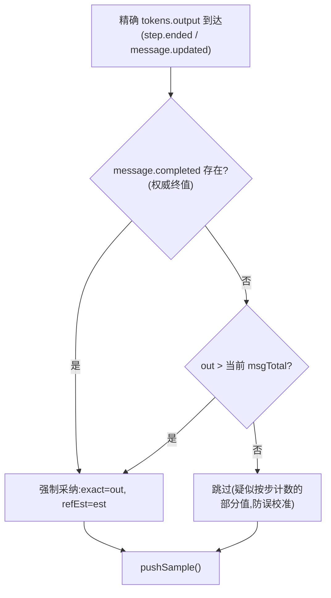

# Token 计量与速率算法

## 实时估算(`estimateTokens`)

流式块没有官方 token 数,用启发式估算:

- CJK(中日韩/假名/谚文)≈ **1 token/字符**
- 其他字符 ≈ **4 字符/token**
- 每块至少计 1

对速率显示而言,窗口内按同一口径估算,比值稳定,误差不放大。

## 精确校准(`adoptExact`)

`session.step.ended` 携带精确 `tokens.output`,但**语义不确定**(可能是消息累计,也可能按步计),采纳规则:

采纳后的公式保证:exact 覆盖之前的 est,**后续 delta 在 exact 基础上继续累加**,不丢不重。

## 采样(`pushSample`)

每次估算/校准变更时追加 `{t: now, tok: turnTotal}` 样本,并修剪 10s 之前的旧样本(滑动窗口)。

## 实时速率(`liveRate`)

每次渲染(500ms tick)对当前 session 的样本窗口求速率:

1. **新鲜度门槛**:最新样本距今 > **4000ms** → 不显示(流式停顿,如工具执行间隙);
2. **基线选择**:取"距最新样本 ≥2500ms"的最早样本,否则取窗口最老样本(窗口 2.5–10s,兼顾"实时感"与平滑);
3. **有效性**:时间跨度 `dt < 0.4s` 或样本不足 2 个 → 不显示;
4. **输出**:`rate = (last.tok − base.tok) / dt`,四舍五入,`rate ≤ 0` 不显示。

## 精确化演进(0.6.2 → 0.6.5)

**动机**:实测 tok/s 与 opencode 自带统计对不上。根因两层——① 流式期为字符启发式估算(±20-30%);② 旧空闲 avg 的分母是**整轮墙钟时间**(含工具执行),而原生统计口径是**消息级生成时长**。

**实证**(本机真实消息,openapi `Session.Message.Assistant`):

- 消息自带 `time: {created, streamed, completed}` 精确时间戳三元组
- 精确速率 = `tokens.output + tokens.reasoning` ÷ `(completed − created)`(生成时长,不含工具执行)
- 无原生实时 tps API(openapi 无 tps 字段,TUI 源码无 tok/s)

**现行实现**:

- **空闲精确值(0.6.5 权威重算)**:轮结束时(`execution.succeeded/failed/interrupted`)从权威消息记录(`session.message.list`)聚合本轮全部 assistant 消息的 `Σ(output+reasoning) ÷ Σ(created→completed)`,与原生同口径且**不依赖事件形状**;记录未同步时 1.5s 延迟重算兜底(幂等)。此前依赖 `message.updated` 单通道被真机证明不可靠(事件未触发即回退墙钟 avg 必然偏低:实测 63 ≈ 70.5 × (15.6s 生成时长 / 17.5s 墙钟))。
- **实时校准(0.6.2)**:每条消息采纳精确 output 时,按 `精确/估算` 比率更新会话级校准系数 `calibs[sessionID]`(EMA:0.7×旧 + 0.3×新,钳位 0.25–4;样本 <20 token 跳过);流式滑窗速率显示时乘该校准系数——首条消息后即开始收敛,后续轮次偏差压到 ~5-10%。
- **校准持久化(0.6.3)**:系数按模型(`provider/model`)存入 `storage.store("usage-meter.calib")`,跨会话/跨 TUI 实例/跨重启复用,新会话冷启动即已校准;子代理会话各自独立收敛。

**已知限制**:首条消息的实时值仍是未校准估算;极短消息(<20 token)不参与校准;采纳精确值瞬间累计曲线可能小幅修正,窗口速率短暂波动。

## 时间戳解析(`tsOf`)

宿主对消息时间戳的交付形态不一(number / ISO string),`tsOf` 做容忍式解析,解析失败返回 undefined 并跳过该消息。
